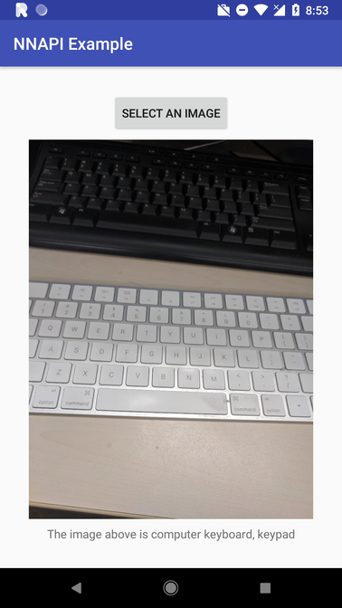

# DNNLibrary

[ ](https://bintray.com/daquexian566/maven/dnnlibrary/_latestVersion)


*Run ONNX models on your Android phone using the new NNAPI !*

Android 8.1 introduces Neural Networks API (NNAPI). It's very exciting to run a model in the "native" way supported by Android System. :)

DNNLibrary is a wrapper of NNAPI ("DNNLibrary" is for "**d**aquexian's **NN**API library). It lets you easily make the use of the new NNAPI introduced in Android 8.1. You can convert your onnx model into `daq` and run the model directly. 

For the Android app example, please check out [daq-example](https://github.com/daquexian/daq-example).

## Screenshot

This screenshot is ResNet-18



This screenshot is LeNet


## Preparation

Clone this repo and submodules:

```bash
git clone --recursive https://github.com/daquexian/DNNLibrary
```

Please make sure the Android System on your phone is 8.1+, or you may want to use 8.1+ emulator.

## Introduction

Android 8.1 introduces NNAPI. However, NNAPI is not friendly to normal Android developers. It is not designed to be used by normal developers directly. So I wrapped it into a library.

With DNNLibrary it's extremely easy to deploy your ONNX model on Android 8.1+ phone. Here is my code to deploy the MobileNet v2 on phone (please check out [daq-example](https://github.com/daquexian/daq-example) for detail):

```Java
ModelBuilder modelBuilder = new ModelBuilder();
Model model = modelBuilder.readFile(getAssets(), "mobilenetv2.daq");
                        .setOutput("mobilenetv20_output_pred_fwd"); // The output name is from the onnx model
                        .compile(ModelBuilder.PREFERENCE_FAST_SINGLE_ANSWER);

float[] result = model.predict(inputData);
```

Only five lines! And the `daq` model file is got from the pretrained onnx model using `onnx2daq`.

## Convert the model

After cloning step listed in Preparation section, run
```bash
mkdir build
cd build
cmake ..
cmake --build .
```

Now `onnx2daq` is in `tools` directory. The following command is to convert onnx model to daq model.

```bash
./tools/onnx2daq <onnx model> <output filename>
```

For example, if you have a model named "mobilenetv2.onnx" in your current directory,
```bash
./tools/onnx2daq mobilenetv2.onnx mobilenetv2.daq
```

## Usage

### If you are an Android app developer and want it to work out of the box

Welcome! It has been published on jcenter.

Add

```
implementation 'me.daquexian:dnnlibrary:0.5.3'
```

(for Gradle 3.0+),

or

```
compile 'me.daquexian:dnnlibrary:0.5.3'
```

(for Gradle lower than 3.0)

in your app's `build.gradle`'s `dependencies` section.

### If you don't care about Android app

We use CMake as the build system. So you can build it as most C++ project, the only difference is that you need Android NDK, **the latest version(r17b) of NDK is necessary** :

```bash
mkdir build && cd build
cmake -DCMAKE_SYSTEM_NAME=Android -DCMAKE_ANDROID_NDK=<path of android ndk> -DCMAKE_ANDROID_ARCH_ABI=arm64-v8a -DCMAKE_ANDROID_NDK_TOOLCHAIN_VERSION=clang -DCMAKE_ANDROID_STL_TYPE=c++_static -DCMAKE_SYSTEM_VERSION=<Android API level, 27 or 28> ..
cmake --build .
```

then you will get binary files.

## But TensorFlow Lite also supports NNAPI...

Yes, but its support for NNAPI is far from perfect. For example, dilated convolution (which is widely used in segmentation) are not supported (https://github.com/tensorflow/tensorflow/blob/master/tensorflow/contrib/lite/nnapi_delegate.cc#L458). 

What's more, only the models got from TensorFlow can easily get converted to TF Lite model. Since NNAPI is independent of any frameworks, we support ONNX, a framework-independent model format.

_ | TF Lite | DNNLibrary
--- |:---:|:---:
Supported Model Format | TensorFlow | ONNX
Dilated Convolution | ❌ | ✔️
Ease of Use | ❌ <br/>(Bazel build system,<br/>not friendly to Android developers) | ✔️ 
Quantization | ✔️ | ❌<br/>(WIP, plan to base on [this](https://github.com/BUG1989/caffe-int8-convert-tools))

However we are also far from maturity comparing to TF Lite. At least we are another choice if you want to enjoy the power of NNAPI :)

## Benchmark

Google Pixel, Android 9.0

model | time
:---:|:---:
MobileNet v2 | 132.95ms
SqueezeNet v1.1 | 80.80ms

More benchmark is welcome!
